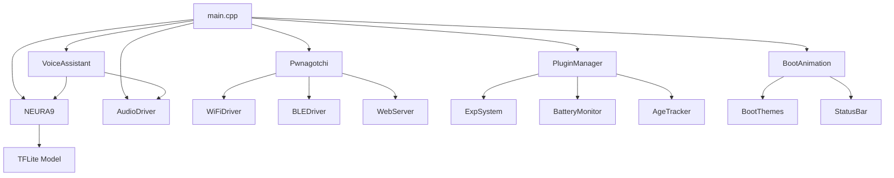

<!-- Badges -->
<p align="center">
  
  
  
</p>

---

# 🏗️ ARQUITETURA DO SISTEMA - WavePwn v2.1.0

## 📋 Visão Geral

O WavePwn é construído com uma arquitetura modular que separa responsabilidades em camadas bem definidas.

```
┌────────────────────────────────────────────────────────────────┐
│                        🖥️ INTERFACE                            │
├────────────────────────────────────────────────────────────────┤
│  LVGL UI   │   Web Dashboard   │   Voice Assistant   │ Serial │
├────────────────────────────────────────────────────────────────┤
│                     🔌 CAMADA DE PLUGINS                        │
├────────────────────────────────────────────────────────────────┤
│ ExpSystem │ BatteryMonitor │ AgeTracker │ SessionStats │ Clock │
├────────────────────────────────────────────────────────────────┤
│                     🧠 CAMADA DE LÓGICA                         │
├────────────────────────────────────────────────────────────────┤
│  Pwnagotchi  │  NEURA9 AI  │  WiFi Attacks  │  BLE Spam       │
├────────────────────────────────────────────────────────────────┤
│                     🔧 CAMADA DE HARDWARE                       │
├────────────────────────────────────────────────────────────────┤
│ Display │ Touch │ WiFi │ BLE │ Audio │ PMU │ IMU │ RTC │ SD   │
└────────────────────────────────────────────────────────────────┘
```

---

## 📁 Estrutura de Módulos

### 🧠 AI (src/ai/)
| Arquivo | Descrição |
|---------|-----------|
| `neura9_inference.h/cpp` | Interface de inferência NEURA9 |

### 📡 WiFi (src/wifi/)
| Arquivo | Descrição |
|---------|-----------|
| `wifi_attacks.h/cpp` | Deauth, Beacon Flood, Probe |
| `captive_portal.h/cpp` | Evil Twin com portal cativo |
| `wps_attacks.h/cpp` | Ataques WPS |

### 🎨 UI (src/ui/)
| Arquivo | Descrição |
|---------|-----------|
| `ui_main.h/cpp` | Tela principal |
| `ui_attacks.h/cpp` | Menu de ataques |
| `ui_settings*.h/cpp` | Configurações (82 opções) |
| `boot_animation.h/cpp` | Animação de boot |
| `boot_themes.h/cpp` | 10 temas de boot |
| `mascot_faces.h/cpp` | 22+ expressões do mascote |
| `status_bar.h/cpp` | Barra de status |
| `notifications_engine.h/cpp` | Sistema de notificações |
| `wallpaper_system.h/cpp` | Sistema de wallpapers |
| `sounds_manager.h/cpp` | Gerenciador de sons |

### 🔧 Hardware (src/hardware/)
| Arquivo | Descrição |
|---------|-----------|
| `wifi_driver.h/cpp` | Driver WiFi |
| `ble_driver.h/cpp` | Driver BLE |
| `audio_driver.h/cpp` | Driver áudio ES8311 |
| `lvgl_driver.h/cpp` | Driver LVGL |
| `system_hardware.h/cpp` | Inicialização de hardware |
| `es8311.h/c` | Codec de áudio |

### 🔌 Plugins (src/plugins/)
| Plugin | Descrição |
|--------|-----------|
| `exp_system` | Sistema de XP e níveis |
| `battery_monitor` | Monitoramento de bateria |
| `age_tracker` | Tempo de funcionamento |
| `session_stats` | Estatísticas de sessão |
| `clock_display` | Display de relógio |
| `memtemp` | Memória e temperatura |
| `internet_check` | Verificação de internet |

### 🐉 Pwnagotchi (src/pwnagotchi/)
| Arquivo | Descrição |
|---------|-----------|
| `pwnagotchi.h/cpp` | Controlador principal |
| `personality.h/cpp` | Personalidade do mascote |

### 🎙️ Voice (src/voice/)
| Arquivo | Descrição |
|---------|-----------|
| `voice_assistant.h/cpp` | Assistente de voz |

### 🌐 Web (src/web/)
| Arquivo | Descrição |
|---------|-----------|
| `web_server.h/cpp` | Servidor web AsyncWebServer |
| `web_api.h/cpp` | APIs REST |

---

## 🔄 Fluxo de Inicialização

```
┌──────────────────────────────────────────────────────────────┐
│ 1. setup()                                                    │
│    ├─ Serial.begin()                                          │
│    ├─ config_manager.begin()     ← Carrega NVS               │
│    ├─ pwn.begin()               ← Hardware + Display + LVGL  │
│    ├─ registerDefaultPlugins()   ← Registra plugins          │
│    ├─ pluginManager.begin()      ← Inicializa plugins        │
│    ├─ neura9.begin()            ← Carrega modelo TFLite      │
│    ├─ audioDriver.begin()        ← ES8311 + I2S              │
│    ├─ voiceAssistant.begin()     ← Wake word + TTS           │
│    └─ bootAnimation.start()      ← Animação de boot          │
└──────────────────────────────────────────────────────────────┘
                            ↓
┌──────────────────────────────────────────────────────────────┐
│ 2. loop()                                                     │
│    ├─ lv_timer_handler()         ← Atualiza LVGL             │
│    ├─ pluginManager.update()     ← Atualiza todos plugins    │
│    ├─ mascotFaces.update()       ← Animações do mascote      │
│    ├─ audioDriver.update()       ← Processa áudio            │
│    ├─ voiceAssistant.update()    ← Processa voz              │
│    ├─ statusBar.update()         ← Atualiza barra de status  │
│    └─ pwn.loop()                 ← Loop principal            │
└──────────────────────────────────────────────────────────────┘
```

---

## 📊 Diagrama de Dependências



---

## 🔐 Segurança

### Princípios de Design
- ✅ **100% Offline** - Nenhum dado enviado para nuvem
- ✅ **Sem Telemetria** - Privacidade total
- ✅ **Configurável** - Usuário controla tudo
- ✅ **Defensivo por Design** - Foco em detecção, não ataque

---

**Última Atualização:** 2025-12-08  
**Versão:** 1.0
